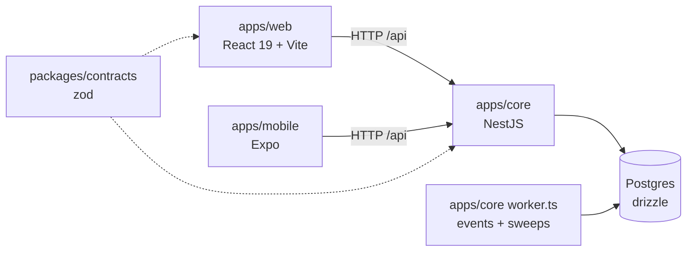
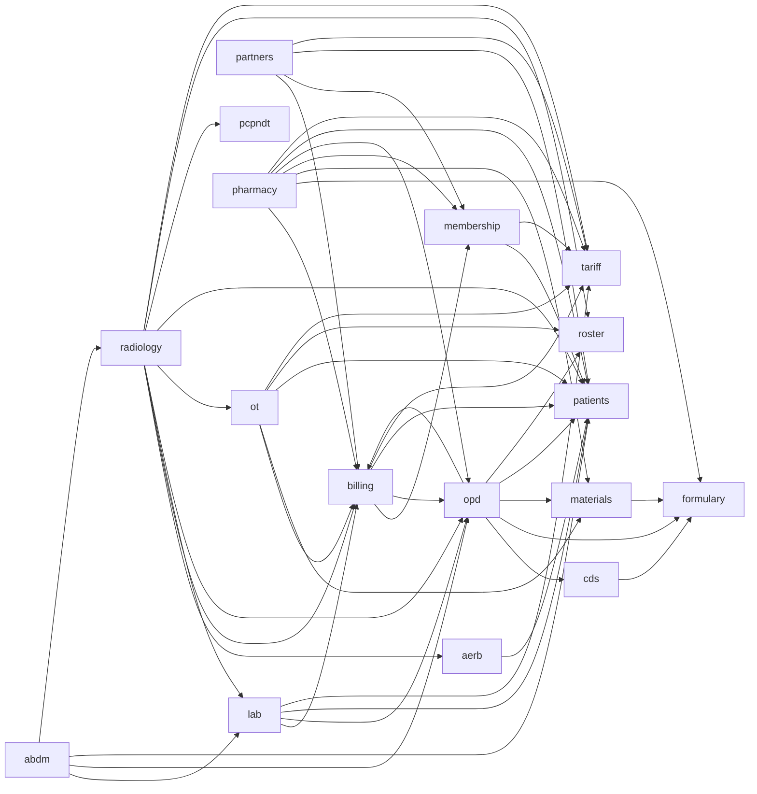

<!-- GENERATED by `node tools/arch/gen.mjs` — do not edit by hand. CI fails when this file is stale. -->

# HMIS architecture map

Generated from the source tree. Read this before exploring code; open a module page for its
dependencies, public API, routes and tables. Regenerate after you change structure:
`node tools/arch/gen.mjs`. After a rebase conflict in this folder, regenerate instead of merging by hand.

## System

## Module dependencies (core)

Arrow = imports through the target's `index.ts`. Shared modules (many arrows in) are expensive to change.

## Modules

| module | depends on | used by | routes | tables |
|---|---|---|---|---|
| [abdm](modules/abdm.md) | lab, opd, patients, radiology | — | 24 | 11 |
| [aerb](modules/aerb.md) | patients | radiology | 30 | 9 |
| [billing](modules/billing.md) | membership, opd, patients, tariff | lab, opd, ot, partners, pharmacy, radiology | 49 | 16 |
| [cds](modules/cds.md) | formulary | opd | 0 | 0 |
| [formulary](modules/formulary.md) | — | cds, materials, opd, pharmacy | 27 | 12 |
| [lab](modules/lab.md) | billing, opd, patients, tariff | abdm, radiology | 48 | 22 |
| [materials](modules/materials.md) | formulary | opd, ot, pharmacy | 117 | 38 |
| [membership](modules/membership.md) | patients, tariff | billing, partners, pharmacy | 11 | 11 |
| [opd](modules/opd.md) | billing, cds, formulary, materials, patients, roster | abdm, billing, lab, pharmacy, radiology | 150 | 29 |
| [ot](modules/ot.md) | billing, materials, patients, roster, tariff | radiology | 53 | 12 |
| [partners](modules/partners.md) | billing, membership, patients, tariff | — | 10 | 7 |
| [patients](modules/patients.md) | — | abdm, aerb, billing, lab, membership, opd, ot, partners, pharmacy, radiology | 31 | 8 |
| [pcpndt](modules/pcpndt.md) | — | radiology | 10 | 5 |
| [pharmacy](modules/pharmacy.md) | billing, formulary, materials, membership, opd, patients, tariff | — | 182 | 32 |
| [radiology](modules/radiology.md) | aerb, billing, lab, opd, ot, patients, pcpndt, roster, tariff | abdm | 113 | 22 |
| [roster](modules/roster.md) | — | opd, ot, radiology | 31 | 26 |
| [tariff](modules/tariff.md) | — | billing, lab, membership, ot, partners, pharmacy, radiology | 18 | 7 |

## Kernel subsystems

Shared platform code in `apps/core/src/kernel/`. Coordinate before editing (see CLAUDE.md).

| subsystem | used by modules | depends on kernel | routes |
|---|---|---|---|
| `alerts` | opd, roster | approvals, auth, db, events, modules, notify, ops, realtime, tokens, workflow | 3 |
| `approvals` | abdm, aerb, billing, lab, materials, membership, ot, partners, patients, pcpndt, pharmacy, radiology, tariff | alerts, auth, db, events, modules, phi, tokens, workflow | 7 |
| `auth` | abdm, aerb, billing, formulary, lab, materials, membership, opd, ot, partners, patients, pcpndt, pharmacy, radiology, roster, tariff | config, crypto, db, events, modules, printing, push, tokens | 33 |
| `config` | abdm, billing, membership, opd, ot, partners, patients, pharmacy, radiology | — | — |
| `copilot` | opd, pharmacy, roster | approvals, auth, config, db, desk, inference, modules, tokens | 1 |
| `crypto` | abdm, billing, opd, patients | — | — |
| `db` | abdm, aerb, billing, cds, formulary, lab, materials, membership, opd, ot, partners, patients, pcpndt, pharmacy, radiology, roster, tariff | — | — |
| `desk` | billing, membership, opd, partners, patients, pharmacy | approvals, auth, db, events, modules, report, tokens, workflow | 9 |
| `documents` | patients, pharmacy | — | — |
| `episodes` | billing, lab, materials, opd, ot, pharmacy, radiology | db | — |
| `events` | abdm, aerb, billing, formulary, lab, materials, membership, opd, ot, partners, patients, pcpndt, pharmacy, radiology, roster, tariff | db, worker | — |
| `inference` | opd | auth, config, db, search, tokens | 1 |
| `modules` | abdm, aerb, billing, formulary, lab, materials, membership, opd, ot, partners, patients, pcpndt, pharmacy, radiology, roster, tariff | alerts, approvals, auth, copilot, desk, ops, orders, resources, search, workflow | — |
| `notify` | abdm, lab, pharmacy, radiology | auth, config, db, events, modules, tokens, workflow | 4 |
| `obligations` | — | alerts, db, events, modules, workflow | — |
| `ops` | lab, pharmacy | auth, config, crypto, db, events, modules, tokens | 11 |
| `orders` | lab, pharmacy, radiology | auth, db, episodes, events, modules, phi | — |
| `phi` | abdm, aerb, billing, lab, opd, patients, pcpndt, pharmacy, radiology | db | — |
| `printing` | billing, opd, pharmacy, roster | auth, crypto, db, events, phi, tokens | 15 |
| `push` | — | alerts, db, events, modules | — |
| `realtime` | lab, opd | auth, db, tokens | — |
| `report` | billing, opd, pharmacy | — | — |
| `resources` | aerb, lab, materials, opd, ot, pharmacy, radiology | auth, db, events, modules, tokens | 3 |
| `retention` | — | db, events, phi, search, worker | — |
| `search` | billing, formulary, membership, opd, patients, tariff | auth, config, db, events, modules, tokens | 2 |
| `tokens` | abdm, aerb, billing, formulary, lab, materials, membership, opd, ot, partners, patients, pcpndt, pharmacy, radiology, roster, tariff | — | — |
| `worker` | — | alerts, approvals, auth, config, db, desk, events, modules, notify, obligations, ops, orders, push, resources, retention, tokens, workflow | — |
| `workflow` | billing, lab, materials, membership, opd, ot, patients, pharmacy, radiology, roster, tariff | auth, db, events, modules, tokens | 9 |

Kernel HTTP routes: [kernel-routes.md](kernel-routes.md). Database: [schema.md](schema.md). Web screens: [web.md](web.md).
