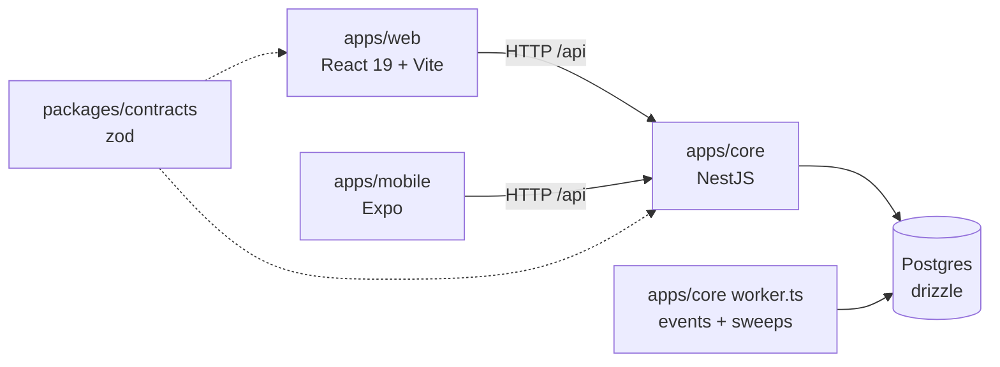
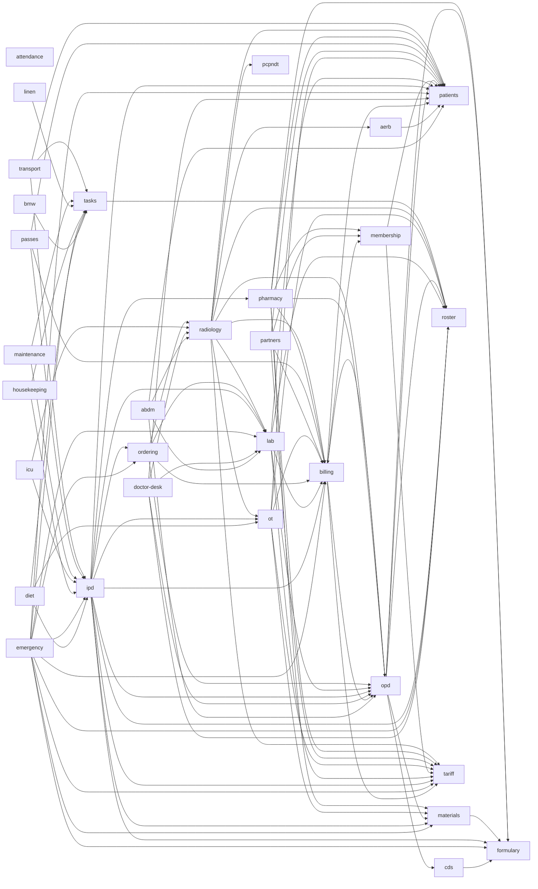

<!-- GENERATED by `node tools/arch/gen.mjs` — do not edit by hand. CI fails when this file is stale. -->

# HMIS architecture map

Generated from the source tree. Read this before exploring code; open a module page for its
dependencies, public API, routes and tables. Regenerate after you change structure:
`node tools/arch/gen.mjs`. After a rebase conflict in this folder, regenerate instead of merging by hand.

## System

```mermaid
flowchart LR
  web["apps/web<br/>React 19 + Vite"] -->|HTTP /api| core["apps/core<br/>NestJS"]
  mobile["apps/mobile<br/>Expo"] -->|HTTP /api| core
  contracts["packages/contracts<br/>zod"] -.-> web
  contracts -.-> core
  core --> pg[(Postgres<br/>drizzle)]
  worker["apps/core worker.ts<br/>events + sweeps"] --> pg
```

## Module dependencies (core)

Arrow = imports through the target's `index.ts`. Shared modules (many arrows in) are expensive to change.

```mermaid
flowchart LR
  abdm[abdm]
  aerb[aerb]
  attendance[attendance]
  billing[billing]
  bmw[bmw]
  cds[cds]
  diet[diet]
  doctor_desk[doctor-desk]
  emergency[emergency]
  formulary[formulary]
  housekeeping[housekeeping]
  icu[icu]
  ipd[ipd]
  lab[lab]
  linen[linen]
  maintenance[maintenance]
  materials[materials]
  membership[membership]
  opd[opd]
  ordering[ordering]
  ot[ot]
  partners[partners]
  passes[passes]
  patients[patients]
  pcpndt[pcpndt]
  pharmacy[pharmacy]
  radiology[radiology]
  roster[roster]
  tariff[tariff]
  tasks[tasks]
  transport[transport]
  abdm --> lab
  abdm --> opd
  abdm --> patients
  abdm --> radiology
  aerb --> patients
  billing --> membership
  billing --> opd
  billing --> patients
  billing --> tariff
  bmw --> tasks
  cds --> formulary
  diet --> ipd
  diet --> ot
  diet --> tasks
  doctor_desk --> lab
  doctor_desk --> opd
  doctor_desk --> patients
  doctor_desk --> radiology
  doctor_desk --> roster
  emergency --> billing
  emergency --> formulary
  emergency --> ipd
  emergency --> lab
  emergency --> materials
  emergency --> ordering
  emergency --> patients
  emergency --> roster
  emergency --> tariff
  emergency --> tasks
  housekeeping --> ipd
  housekeeping --> tasks
  icu --> ipd
  icu --> radiology
  ipd --> billing
  ipd --> formulary
  ipd --> lab
  ipd --> materials
  ipd --> opd
  ipd --> ordering
  ipd --> ot
  ipd --> patients
  ipd --> pharmacy
  ipd --> roster
  ipd --> tariff
  lab --> billing
  lab --> opd
  lab --> patients
  lab --> roster
  lab --> tariff
  linen --> tasks
  maintenance --> ipd
  maintenance --> tasks
  materials --> formulary
  membership --> patients
  membership --> tariff
  opd --> billing
  opd --> cds
  opd --> formulary
  opd --> materials
  opd --> patients
  opd --> roster
  ordering --> billing
  ordering --> lab
  ordering --> opd
  ordering --> radiology
  ot --> billing
  ot --> materials
  ot --> patients
  ot --> roster
  ot --> tariff
  partners --> billing
  partners --> membership
  partners --> patients
  partners --> tariff
  passes --> billing
  passes --> ipd
  passes --> patients
  pharmacy --> billing
  pharmacy --> formulary
  pharmacy --> materials
  pharmacy --> membership
  pharmacy --> opd
  pharmacy --> patients
  pharmacy --> tariff
  radiology --> aerb
  radiology --> billing
  radiology --> lab
  radiology --> opd
  radiology --> ot
  radiology --> patients
  radiology --> pcpndt
  radiology --> roster
  radiology --> tariff
  tasks --> roster
  transport --> ipd
  transport --> patients
  transport --> tasks
```

## Modules

| module | depends on | used by |
|---|---|---|
| [abdm](modules/abdm.md) | lab, opd, patients, radiology | — |
| [aerb](modules/aerb.md) | patients | radiology |
| [attendance](modules/attendance.md) | — | — |
| [billing](modules/billing.md) | membership, opd, patients, tariff | emergency, ipd, lab, opd, ordering, ot, partners, passes, pharmacy, radiology |
| [bmw](modules/bmw.md) | tasks | — |
| [cds](modules/cds.md) | formulary | opd |
| [diet](modules/diet.md) | ipd, ot, tasks | — |
| [doctor-desk](modules/doctor-desk.md) | lab, opd, patients, radiology, roster | — |
| [emergency](modules/emergency.md) | billing, formulary, ipd, lab, materials, ordering, patients, roster, tariff, tasks | — |
| [formulary](modules/formulary.md) | — | cds, emergency, ipd, materials, opd, pharmacy |
| [housekeeping](modules/housekeeping.md) | ipd, tasks | — |
| [icu](modules/icu.md) | ipd, radiology | — |
| [ipd](modules/ipd.md) | billing, formulary, lab, materials, opd, ordering, ot, patients, pharmacy, roster, tariff | diet, emergency, housekeeping, icu, maintenance, passes, transport |
| [lab](modules/lab.md) | billing, opd, patients, roster, tariff | abdm, doctor-desk, emergency, ipd, ordering, radiology |
| [linen](modules/linen.md) | tasks | — |
| [maintenance](modules/maintenance.md) | ipd, tasks | — |
| [materials](modules/materials.md) | formulary | emergency, ipd, opd, ot, pharmacy |
| [membership](modules/membership.md) | patients, tariff | billing, partners, pharmacy |
| [opd](modules/opd.md) | billing, cds, formulary, materials, patients, roster | abdm, billing, doctor-desk, ipd, lab, ordering, pharmacy, radiology |
| [ordering](modules/ordering.md) | billing, lab, opd, radiology | emergency, ipd |
| [ot](modules/ot.md) | billing, materials, patients, roster, tariff | diet, ipd, radiology |
| [partners](modules/partners.md) | billing, membership, patients, tariff | — |
| [passes](modules/passes.md) | billing, ipd, patients | — |
| [patients](modules/patients.md) | — | abdm, aerb, billing, doctor-desk, emergency, ipd, lab, membership, opd, ot, partners, passes, pharmacy, radiology, transport |
| [pcpndt](modules/pcpndt.md) | — | radiology |
| [pharmacy](modules/pharmacy.md) | billing, formulary, materials, membership, opd, patients, tariff | ipd |
| [radiology](modules/radiology.md) | aerb, billing, lab, opd, ot, patients, pcpndt, roster, tariff | abdm, doctor-desk, icu, ordering |
| [roster](modules/roster.md) | — | doctor-desk, emergency, ipd, lab, opd, ot, radiology, tasks |
| [tariff](modules/tariff.md) | — | billing, emergency, ipd, lab, membership, ot, partners, pharmacy, radiology |
| [tasks](modules/tasks.md) | roster | bmw, diet, emergency, housekeeping, linen, maintenance, transport |
| [transport](modules/transport.md) | ipd, patients, tasks | — |

## Kernel subsystems

Shared platform code in `apps/core/src/kernel/`. Coordinate before editing (see CLAUDE.md).

| subsystem | used by modules | depends on kernel | serves HTTP |
|---|---|---|---|
| `alerts` | attendance, bmw, diet, doctor-desk, emergency, icu, ipd, lab, maintenance, opd, roster, tasks, transport | approvals, auth, db, events, modules, notify, ops, realtime, reminders, tokens, workflow | yes |
| `approvals` | abdm, aerb, attendance, billing, bmw, diet, doctor-desk, emergency, formulary, icu, ipd, lab, linen, materials, membership, ot, partners, passes, patients, pcpndt, pharmacy, radiology, roster, tariff | alerts, auth, db, events, modules, phi, tokens, workflow | yes |
| `auth` | abdm, aerb, attendance, billing, bmw, diet, doctor-desk, emergency, formulary, housekeeping, icu, ipd, lab, linen, maintenance, materials, membership, opd, ordering, ot, partners, passes, patients, pcpndt, pharmacy, radiology, roster, tariff, tasks, transport | config, crypto, db, events, modules, printing, push, ratelimit, tokens | yes |
| `config` | abdm, attendance, billing, emergency, formulary, ipd, lab, membership, opd, ot, partners, patients, pharmacy, radiology | modules | — |
| `copilot` | billing, doctor-desk, emergency, formulary, ipd, lab, opd, pharmacy, roster | alerts, approvals, auth, config, db, desk, events, inference, modules, ratelimit, reminders, search, tokens, workflow | yes |
| `crypto` | abdm, billing, ipd, opd, patients | — | — |
| `db` | abdm, aerb, attendance, billing, bmw, cds, diet, doctor-desk, emergency, formulary, housekeeping, icu, ipd, lab, linen, maintenance, materials, membership, opd, ordering, ot, partners, passes, patients, pcpndt, pharmacy, radiology, roster, tariff, tasks, transport | — | — |
| `desk` | attendance, billing, diet, doctor-desk, emergency, ipd, lab, membership, opd, partners, patients, pharmacy, radiology, roster | approvals, auth, db, events, modules, reminders, report, tokens, workflow | yes |
| `documents` | lab, patients, pharmacy | — | — |
| `episodes` | billing, emergency, ipd, lab, materials, opd, ot, pharmacy, radiology | db | — |
| `events` | abdm, aerb, attendance, billing, diet, doctor-desk, emergency, formulary, housekeeping, icu, ipd, lab, materials, membership, opd, ordering, ot, partners, passes, patients, pcpndt, pharmacy, radiology, roster, tariff | db, worker | — |
| `inference` | formulary, ipd, lab, opd | auth, config, db, ratelimit, search, tokens | yes |
| `modules` | abdm, aerb, attendance, billing, bmw, diet, doctor-desk, emergency, formulary, housekeeping, icu, ipd, lab, linen, maintenance, materials, membership, opd, ordering, ot, partners, passes, patients, pcpndt, pharmacy, radiology, roster, tariff, tasks, transport | alerts, approvals, auth, config, copilot, desk, ops, orders, resources, search, workflow | — |
| `notify` | abdm, ipd, lab, pharmacy, radiology | auth, config, db, events, modules, tokens, workflow | yes |
| `obligations` | — | alerts, db, events, modules, workflow | — |
| `ops` | icu, lab, pharmacy | auth, config, crypto, db, events, modules, tokens | yes |
| `orders` | emergency, ipd, lab, ordering, pharmacy, radiology | auth, db, episodes, events, modules, phi | — |
| `phi` | abdm, aerb, billing, doctor-desk, lab, opd, patients, pcpndt, pharmacy, radiology | db | — |
| `printing` | billing, bmw, emergency, ipd, lab, opd, pharmacy, roster | auth, crypto, db, events, phi, tokens | yes |
| `push` | — | alerts, db, events, modules | — |
| `ratelimit` | — | — | — |
| `realtime` | emergency, ipd, lab, opd | auth, db, tokens | — |
| `reminders` | — | alerts, auth, copilot, db, tokens | yes |
| `report` | billing, bmw, lab, opd, pharmacy, radiology | db | — |
| `resources` | aerb, housekeeping, icu, ipd, lab, linen, materials, opd, ot, pharmacy, radiology | auth, db, events, modules, tokens | yes |
| `retention` | — | db, events, phi, search, worker | — |
| `search` | billing, formulary, membership, opd, patients, tariff | auth, config, db, events, modules, tokens | yes |
| `tokens` | abdm, aerb, attendance, billing, bmw, diet, doctor-desk, emergency, formulary, housekeeping, icu, ipd, lab, linen, maintenance, materials, membership, opd, ordering, ot, partners, passes, patients, pcpndt, pharmacy, radiology, roster, tariff, tasks, transport | — | — |
| `worker` | — | alerts, approvals, auth, config, copilot, db, desk, documents, events, modules, notify, obligations, ops, orders, push, reminders, resources, retention, tokens, workflow | — |
| `workflow` | attendance, billing, bmw, emergency, ipd, lab, maintenance, materials, membership, opd, ot, patients, pharmacy, radiology, roster, tariff, tasks, transport | auth, db, events, modules, tokens | yes |

Kernel HTTP routes: [kernel-routes.md](kernel-routes.md). Database: [schema.md](schema.md). Web screens: [web.md](web.md).
