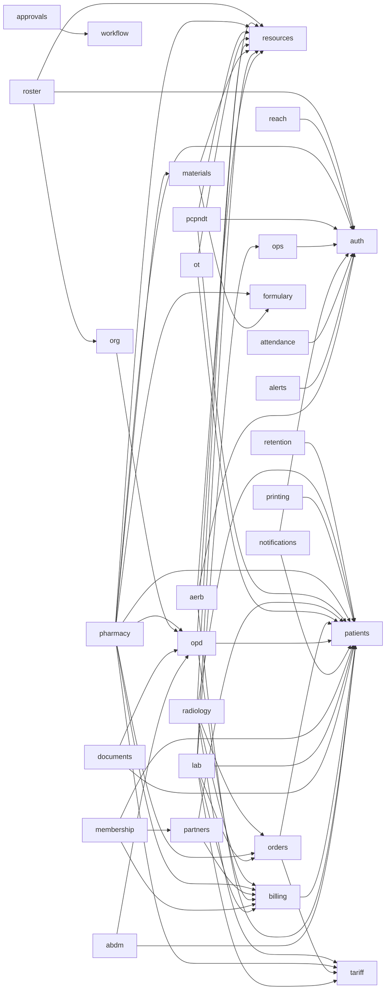

<!-- GENERATED by `node tools/arch/gen.mjs` — do not edit by hand. CI fails when this file is stale. -->

# Database schema

One file per area in `apps/core/src/kernel/db/schema/`. Arrow = a foreign key from one file's tables into another's.

| file | owner | tables |
|---|---|---|
| `abdm.ts` | module abdm | `abdm_care_contexts`, `abdm_consents`, `abdm_external_records`, `abdm_health_info_requests`, `abdm_hiu_consent_artefacts`, `abdm_hiu_consent_requests`, `abdm_hiu_data_requests`, `abdm_link_requests`, `abdm_link_tokens`, `abdm_messages`, `abdm_profile_shares` |
| `aerb.ts` | module aerb | `aerb_incidents`, `aerb_licences`, `aerb_persons`, `aerb_pregnancy_declarations`, `aerb_qa_records`, `aerb_settings`, `aerb_tld_badges`, `aerb_tld_reads`, `radiation_dose_register` |
| `alerts.ts` | kernel | `alerts` |
| `approvals.ts` | kernel | `approval_types`, `approvals` |
| `attendance.ts` | module attendance | `att_app_marks`, `att_days`, `att_holidays`, `att_leaves`, `att_meeting_requests`, `att_on_duty`, `att_punches`, `att_roster`, `att_shifts`, `att_staff`, `att_sync_state` |
| `auth.ts` | kernel | `agents`, `auth_devices`, `auth_sessions`, `auth_throttle`, `break_glass_grants`, `permissions`, `phone_push_sends`, `role_assignments`, `role_permissions`, `roles`, `sod_pairs`, `temp_role_grants`, `user_totp`, `users` |
| `billing.ts` | module billing | `allocations`, `billing_config`, `cashier_sessions`, `credit_note_lines`, `credit_notes`, `daily_closes`, `document_series`, `entered_in_error_marks`, `idempotency_keys`, `invoice_lines`, `invoices`, `receipt_tenders`, `receipts`, `recon_batches`, `recon_resolutions`, `refund_vouchers` |
| `clinical-coding.ts` | kernel | `icd10_codes`, `icd11_map_loads`, `icd11_map_rows` |
| `copilot.ts` | kernel | `copilot_acts`, `copilot_asks`, `copilot_notice_acks` |
| `desk.ts` | kernel | `user_day_facts` |
| `documents.ts` | kernel | `patient_documents` |
| `episodes.ts` | kernel | `episode_series` |
| `eventCursors.ts` | kernel | `event_cursors` |
| `eventIdempotency.ts` | kernel | `event_idempotency` |
| `events.ts` | kernel | `events` |
| `formulary.ts` | module formulary | `formulary_drug_disease`, `formulary_generic_substances`, `formulary_generics`, `formulary_interactions`, `formulary_mapping_proposals`, `formulary_medicine_salts`, `formulary_medicines`, `formulary_monographs`, `formulary_renal_doses`, `formulary_salts`, `formulary_staging`, `formulary_substances` |
| `lab.ts` | module lab | `lab_analytes`, `lab_catalogue_imports`, `lab_critical_calls`, `lab_instrument_codes`, `lab_instruments`, `lab_items`, `lab_orderable_analytes`, `lab_orderables`, `lab_parked_results`, `lab_plate_maps`, `lab_plate_wells`, `lab_reference_ranges`, `lab_reflex_rules`, `lab_report_deliveries`, `lab_reports`, `lab_results`, `lab_run_sheet_positions`, `lab_run_sheets`, `lab_sla_breaches`, `lab_specimen_items`, `lab_specimens`, `lab_transmissions` |
| `materials.ts` | module materials | `consignment_lots`, `controlled_stock_register`, `grn_lines`, `grns`, `item_barcodes`, `item_merges`, `item_price_regulations`, `item_stock_levels`, `item_uoms`, `items`, `materials_settings`, `purchase_order_lines`, `purchase_orders`, `stock_adjustments`, `stock_balances`, `stock_batches`, `stock_count_lines`, `stock_counts`, `stock_ledger`, `stock_recalls`, `stock_reservations`, `stock_write_off_lines`, `stock_write_offs`, `store_indent_lines`, `store_indents`, `supplier_bill_lines`, `supplier_bills`, `supplier_credit_notes`, `supplier_payment_run_lines`, `supplier_payment_runs`, `supplier_payments`, `supplier_return_lines`, `supplier_returns`, `transfer_lines`, `transfers`, `vendor_bank_changes`, `vendor_documents`, `vendors` |
| `membership.ts` | module membership | `coupon_definitions`, `coupon_redemptions`, `covered_members`, `entitlement_counters`, `entitlement_movements`, `holder_book_imports`, `import_quarantine`, `lapsed_restore_checks`, `membership_instances`, `membership_plans`, `patient_match_queue` |
| `notifications.ts` | kernel | `notifications`, `notify_template_registrations`, `patient_message_preferences` |
| `opd.ts` | module opd | `cds_aliases`, `cds_doctor_prefs`, `cds_rx_lines`, `opd_advice_templates`, `opd_appointments`, `opd_complaint_concepts`, `opd_complaint_term_usage`, `opd_complaint_terms`, `opd_config`, `opd_consult_layouts`, `opd_department_tokens`, `opd_departments`, `opd_doctor_leaves`, `opd_doctor_schedules`, `opd_doctors`, `opd_encounter_diagnoses`, `opd_encounters`, `opd_flow_baselines`, `opd_flow_findings`, `opd_lasa_pairs`, `opd_patient_reminders`, `opd_prescription_drafts`, `opd_prescriptions`, `opd_queue_entries`, `opd_queue_sessions`, `opd_rx_sets`, `opd_section_records`, `opd_suggestion_events`, `opd_term_misses`, `opd_vitals`, `opd_voice_settings`, `opd_voice_usage` |
| `ops.ts` | kernel | `config_validation_reports`, `downtime_form_counters`, `downtime_kit_ranges`, `downtime_kits`, `interfaces`, `operating_mode_changes` |
| `orders.ts` | kernel | `order_item_transitions`, `order_items`, `orders` |
| `org.ts` | kernel | `org_departments` |
| `ot.ts` | module ot | `daycare_encounters`, `ot_case_gates`, `ot_case_implants`, `ot_cases`, `ot_checklist_runs`, `ot_counts`, `ot_definitions`, `ot_deposit_holds`, `ot_incidents`, `ot_lists`, `ot_specimens`, `pacu_scores` |
| `partners.ts` | module partners | `attribution_ids`, `commission_accrual_subjects`, `commission_accruals`, `counterparties`, `partner_agreements`, `partner_ref_map`, `receivable_expectations` |
| `patients.ts` | module patients | `patient_allergies`, `patient_coverages`, `patient_guardians`, `patient_identity_versions`, `patient_merge_requests`, `patient_photos`, `patients`, `registration_config` |
| `pcpndt.ts` | module pcpndt | `pcpndt_form_f`, `pcpndt_form_f_serials`, `pcpndt_registered_machines`, `pcpndt_registered_persons`, `pcpndt_registrations` |
| `pharmacy.ts` | module pharmacy | `pharmacy_adr_events`, `pharmacy_adr_reports`, `pharmacy_adr_suspects`, `pharmacy_authorisations`, `pharmacy_cold_excursion_batches`, `pharmacy_cold_excursion_closes`, `pharmacy_cold_excursion_decisions`, `pharmacy_cold_excursions`, `pharmacy_cold_readings`, `pharmacy_cold_units`, `pharmacy_controlled_licences`, `pharmacy_credit_moves`, `pharmacy_dispense_lines`, `pharmacy_dispenses`, `pharmacy_end_prescribers`, `pharmacy_medication_incident_events`, `pharmacy_medication_incidents`, `pharmacy_message_settings`, `pharmacy_pharmacist_registrations`, `pharmacy_reg_h1`, `pharmacy_retail_licences`, `pharmacy_retail_sale_lines`, `pharmacy_retail_sales`, `pharmacy_sale_items`, `pharmacy_settings`, `pharmacy_shelf_locations`, `pharmacy_short_book`, `pharmacy_tally_config`, `pharmacy_tally_exports`, `pharmacy_tray_check_lines`, `pharmacy_tray_checks`, `pharmacy_tray_templates` |
| `phi-access.ts` | kernel | `phi_access_log` |
| `printing.ts` | kernel | `print_computers`, `print_enrolment_codes`, `print_jobs` |
| `radiology.ts` | module radiology | `imaging_bill_decisions`, `imaging_contrast_administrations`, `imaging_contrast_reactions`, `imaging_critical_call_attempts`, `imaging_critical_findings`, `imaging_definitions`, `imaging_dose_sr_receipts`, `imaging_followups`, `imaging_image_views`, `imaging_ir_cases`, `imaging_ir_checklists`, `imaging_ir_sedation_vitals`, `imaging_media_requests`, `imaging_outside_studies`, `imaging_peer_reviews`, `imaging_report_delivery`, `imaging_report_handovers`, `imaging_reports`, `imaging_safety_screenings`, `imaging_studies`, `imaging_tele_reads`, `imaging_unmatched_studies` |
| `reach.ts` | kernel | `push_subscriptions`, `user_reach_profiles` |
| `resources.ts` | kernel | `resource_status_history`, `resources` |
| `retention.ts` | kernel | `retention_legal_holds` |
| `roster.ts` | module roster | `roster_amendments`, `roster_assignments`, `roster_bed_allotments`, `roster_board_prints`, `roster_cover_requests`, `roster_cycle_entries`, `roster_cycle_overlays`, `roster_cycles`, `roster_delegations`, `roster_duty_windows`, `roster_escalation_targets`, `roster_findings`, `roster_flags`, `roster_holidays`, `roster_mode_declarations`, `roster_officiating`, `roster_periods`, `roster_positions`, `roster_requirements`, `roster_rule_profiles`, `roster_rules`, `roster_shift_defs`, `roster_team_memberships`, `roster_teams`, `staff_absences`, `staff_credentials` |
| `search.ts` | kernel | `search_audit` |
| `tariff.ts` | module tariff | `adjustment_rules`, `gst_config`, `gst_settings`, `regulated_prices`, `services`, `tariff_items`, `tariff_versions` |
| `worker.ts` | kernel | `event_dead_letters`, `event_deliveries`, `scheduler_heartbeats` |
| `workflow.ts` | kernel | `workflow_definition_approvals`, `workflow_definitions`, `workflow_instances`, `workflow_timers`, `workflow_transitions` |
