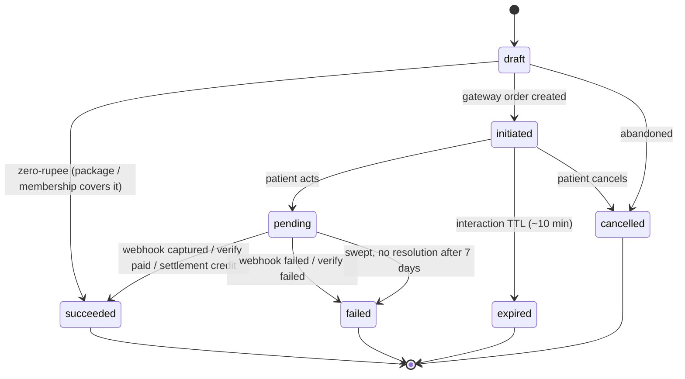

# Plan 22a — the payment gateway adapter
**Date:** 2026-08-27 · **Status:** working document, not approved · **Register:** R-261
**Consumed by:** 22c (patient app) · 23 tele · 24 home · 26 packages · 27 CRM · 16f pharmacy
**Companions:** `00-RECORD-AND-PLAN.md` · `01-MEDANTA-TEARDOWN.md` §3 F1–F29

---

## 1. Frame

**One adapter for the whole hospital.** Five modules need online money and none of them
builds its own. The gateway is swappable behind a five-function interface; everything
else in this document is gateway-agnostic.

### 1.1 What Plan 08 already gives us

| Asset | Why it matters here |
|---|---|
| `idempotencyKeys` — `(actorId, route, key)` unique, request hash, response replayed verbatim | **Most of an intent's idempotency is already built and tested.** We extend it, we do not reinvent it. |
| `receiptTenders.state` — `captured → reconciled \| mismatched`, with `expectedNetPaise` stamped at capture and `settledPaise` on reconcile | The gateway settlement file drops straight into this lifecycle. It was designed for counter UPI/card recon and fits online unchanged. |
| `receipts` — *"a bill payment and an advance are the SAME row — the difference is allocation"* | The exact shape needed when money lands but the slot is gone: **record the money, allocate nothing, refund from there.** |
| `allocations` — append-only, effective = Σ apply − Σ reverse | Refunds never rewind state. |
| Daily close + orphan scan | The reconciliation exception path already has a home. |
| `feeBps: { upi, card }`, `refundBankAbovePaise`, degraded tender mode (E-24) | Fee accounting, refund thresholds and a degraded posture already exist. |
| Cash-law C-2 excludes non-cash **at the SQL level** | Online is non-cash. Nothing to change; everything to test. |

### 1.2 The blocker — read this before writing any code

```
receipts.cashierSessionId  text NOT NULL  REFERENCES cashier_sessions(id)
```

**Every rupee that has ever entered this system entered through a named cashier's open
drawer.** An online payment has no cashier and no drawer. Two options:

- ❌ **Synthetic "online" cashier session.** Works on day one, then poisons variance,
  daily close and every session-grouped report forever with a cashier who does not exist.
- ✅ **Nullable `cashierSessionId` + a `channel` discriminator**, with a check constraint
  so the two can never disagree:

```sql
ALTER TABLE receipts ADD COLUMN channel text NOT NULL DEFAULT 'counter';
ALTER TABLE receipts ALTER COLUMN cashier_session_id DROP NOT NULL;
ALTER TABLE receipts ADD CONSTRAINT receipts_channel_session_ck CHECK (
  (channel = 'counter' AND cashier_session_id IS NOT NULL) OR
  (channel = 'online'  AND cashier_session_id IS NULL)
);
```

**`channel`, not a new tender mode.** `mode` still answers "was it UPI or card" for
`feeBps`, and cash-law still asks "is it cash" — both orthogonal to where it was taken.

**T1 is this migration plus an audit of every reader of `cashierSessionId`.** It is cheap
now and horrible after six months of receipts.

---

## 2. The intent

### 2.1 Why an intent and not a payment

For a window that can last from seconds to days, **the existence of the money is
uncertain**. We need a durable local object that predates the gateway knowing anything,
survives every failure mode, and can be resumed from a cold browser on a different device.

### 2.2 States

| State | Meaning | Cancellable? |
|---|---|---|
| `draft` | Created locally. Cart bound, amount computed **server-side**, hold taken. No gateway contact. | Yes, freely |
| `initiated` | Gateway order exists; the patient has a checkout to act on. Nothing attempted. | Yes, safely |
| `pending` | **An attempt is in flight.** UPI collect sent, 3DS in progress, QR scanned. | **No — money may be moving** |
| `succeeded` | Money confirmed ours, by webhook, verify, or settlement | Terminal |
| `failed` | The gateway definitively says no | Terminal |
| `expired` | Interaction TTL elapsed with nothing attempted | Terminal |
| `cancelled` | Abandoned before any money moved | Terminal |

The `initiated` / `pending` split is the whole point: it is what prevents both the
double-charge and the cancel-while-debiting race.

**Refunds and disputes are child rows, never states.** The intent stays `succeeded`;
`payment_refunds` accumulate against it and the refunded amount is derived — the same
append-only discipline as `allocations`.

### 2.3 The machine



**`pending` has no TTL of its own.** It leaves only when an authority says so. What the
pending clock governs is the **hold**, not the intent — see §4.

### 2.4 Invariants

1. **The amount is computed server-side and frozen at `initiated`.** The client never
   sends an amount. A mismatch anywhere voids the intent and raises a security event.
2. **One live intent per cart.** Enforced through `idempotencyKeys`, not by convention.
3. **A `succeeded` intent produces exactly one receipt.** Exactly-once, in one transaction.
4. **`succeeded` is irreversible.** Money out is a refund child, never a state rewind.
5. **State only moves forward.** A late webhook carrying an earlier state is logged and
   ignored. Out-of-order delivery is normal, not exceptional.
6. **Signature verified before any state is read.** Not after parsing — before.
7. **`pending → succeeded` requires an exact paise match** against the frozen amount.

---

## 3. Three sources of truth — and the redirect is none of them

The browser redirect is a UX convenience and **zero percent of the truth**. It is lost
whenever a tab closes, a battery dies, or a network drops — which is precisely when money
is most likely to be in flight.

| Source | Latency | Role | Failure it covers |
|---|---|---|---|
| **Webhook** (signature-verified) | seconds | Fast path | — |
| **Verify / poll** on any intent open past N minutes | minutes | Backstop | Webhook never delivered, or our endpoint was down |
| **Settlement file** into Plan 08's T+1 recon | T+1 / T+2 | **The truth** | Everything else, including late credits against `failed` intents |

Build all three. Each covers a failure the others do not. The moment all three exist,
**"please do not refresh this page" becomes impossible to write**, because state no longer
lives in the tab. Reopening the intent URL reads its true state on any device.

---

## 4. The hold ↔ intent coupling — two clocks

The un-retrofittable decision (`01-MEDANTA-TEARDOWN.md` D3).

**While an intent is live, the hold cannot expire.** But "live" splits:

| Clock | Window | Hold |
|---|---|---|
| **Interaction** | ~10 min from `initiated` | Firm. The patient is at the checkout. |
| **Pending** | ~20 min from `pending` | Firm. An attempt is in flight. |
| **Beyond** | — | **Hold releases. The intent stays alive.** A UPI collect can sit pending for hours; a 9 a.m. cardiology slot cannot. |

### 4.1 Late landing — resolved without a judgment call

When money arrives on an intent whose hold is gone:

- **Slot still free** → re-take it, confirm the booking, done. The patient never learns
  anything went wrong.
- **Slot taken** → **record the money as an unallocated advance and auto-refund**, with
  the next available slots offered in the same message.

`receipts` already models this exactly: a payment and an advance are the same row,
differing only in allocation. **We never refuse to record money that is ours.** Whether it
attaches to an invoice is a separate question, and that separation is what makes this case
clean instead of a special path.

> Earlier in this session I recommended "honour and overbook". That is right when the
> patient is standing at the counter and wrong when they are at home. Slot-free-or-refund
> covers both without anyone deciding.

---

## 5. Failed-but-debited — a support workflow, not an error state

The highest-volume payment incident in Indian systems, and almost nobody builds for it.

**The mechanics.** The patient's bank debits; our leg fails or times out; the gateway
reports failure. Under RBI's Turn Around Time harmonisation framework the bank
**auto-reverses within a prescribed window (T+1 for UPI, longer for some rails), with
per-day compensation payable by the bank beyond it.** *(Counsel to confirm the current
timelines once; they are the bank's liability, not ours, but we must state them correctly
to the patient.)*

**The money is usually coming back on its own.** So the job is four things, none of them
"retry":

1. **Do not lose the booking.**
2. **Tell the truth with a timeline.** *"Your bank shows a debit but the payment did not
   reach us. Banks reverse this automatically — usually within a few working days. Your
   appointment is held until 8:00 a.m. on 28 Aug."* Never a generic error.
3. **Reconcile against the settlement file**, in case it did reach us after all — that is
   a late `pending → succeeded`, handled by §4.1.
4. **Give the counter a `payment_debit_disputes` record.** The patient *will* arrive with
   a bank SMS, and today the cashier would be blind. This single table turns a furious
   counter argument into a thirty-second lookup.

Dispute lifecycle: `raised → bank_reversed | credited_late | written_off`.

---

## 6. Data model

```
payment_intents
  id, idempotency_key, patient_id, cart_ref, hold_ref
  amount_paise (frozen at initiated), currency
  state, state_reason
  gateway, gateway_order_id, gateway_payment_id, method
  interaction_expires_at, hold_expires_at
  created_by, created_at, updated_at, terminal_at

payment_events                     -- every webhook and verify response, raw
  id, intent_id, gateway_event_id (unique), direction, type
  raw_payload jsonb, signature_ok, received_at, applied  -- applied=false ⇒ ignored (out of order)

payment_refunds                    -- child rows; refunded = Σ succeeded
  id, intent_id, receipt_id, amount_paise, reason_class, policy_ref
  approval_id, gateway_refund_id, state, requested_by, requested_at

payment_debit_disputes
  id, intent_id, patient_id, claimed_amount_paise, bank_ref, patient_statement
  state, raised_by, raised_at, resolved_at, resolution_note

payment_settlement_lines           -- parsed settlement file
  id, gateway, settlement_ref, gateway_payment_id, gross_paise, fee_paise, net_paise
  settled_on, matched_intent_id, exception_code
```

**Plan 08 extensions:** `receipts.channel`, `cashierSessionId` nullable + check constraint
(§1.2); `receiptTenders.mode` gains `netbanking` and `wallet`.

---

## 7. The success transaction — the dangerous moment

`pending → succeeded` must do all of this **in one transaction**, or none of it:

1. Move the intent to `succeeded` (guarded on current state — the idempotency point)
2. Create the receipt — `channel='online'`, `cashier_session_id=NULL`
3. Create the tender row — mode from the gateway, `expectedNetPaise` stamped
4. Allocate to the invoice — **or leave unallocated** if the slot is gone (§4.1)
5. Convert the hold into a confirmed booking — **or not**, per §4.1
6. Append `payment.succeeded`

If any step fails the whole thing rolls back and the webhook is retried. This is why
step 1 is guarded and why `payment_events.gateway_event_id` is unique: **the same webhook
delivered five times produces one receipt.**

---

## 8. Refunds — three rails, one rule

| Rail | When | Approval |
|---|---|---|
| **Refund-to-source** (gateway) | Anything paid online | Auto below threshold for hospital fault; approval above |
| **Counter cash** (Plan 08) | Paid in cash | Existing rules |
| **Bank transfer** (Plan 08) | Above ₹10k | Existing approval + payee identity |

**The rule: a refund follows the tender that was taken.** That is not tidiness — allowing
an online payment to be refunded as counter cash is the classic stolen-instrument
laundering path. **Refund-to-source is an anti-fraud control**, and it should be
structurally impossible to convert an online payment into cash at a desk.

It also disposes of F14 for free: when a son pays for his mother, refund-to-source returns
money to the instrument that paid — which *is* the payer. Plan 08's refund-to-payer
identity check then only has to bite on manual refunds.

Policy shape is already ruled (index §4 theme 18): **policy JSON in the programme/package
definition, not code**; auto-refund below a threshold for hospital fault; approval above;
bank transfer above ₹10k; **one golden suite** (§12).

Reason classes: `hospital_cancelled` · `doctor_unavailable` · `duplicate_payment` ·
`slot_lost` · `patient_cancelled` · `no_show` · `overcharge` · `service_not_rendered`.
The class, not a free-text note, drives the policy.

---

## 9. Paths that never touch the gateway

| Path | Behaviour |
|---|---|
| **Free revisit** | **Resolve the new/renewal branch BEFORE requesting money.** Plan 08 already branches it; if the app does not call the same resolver we charge for free revisits and refund them at the desk all day. Medanta's flat fee guarantees this failure — we simply do not have it. |
| **Zero-rupee** | Membership or package covers it: no intent, no gateway call, but still a booking, an invoice and an allocation. `draft → succeeded` directly. |
| **Pay later** | No intent at all. A booking with a deadline, a stated consequence, and the UNPAID card. |
| **Degraded (gateway down)** | Pay-later stays open, the truth is stated, the booking is never lost. Plan 08's E-24 degraded tender mode is the precedent and the posture. |

---

## 10. The adapter interface

Narrow by design. Everything gateway-specific lives behind these five:

```ts
createOrder(intentId, amountPaise, patientRef, description)
  -> { gatewayOrderId, checkoutToken }
verify(gatewayOrderId)
  -> { status, amountPaise, method, gatewayPaymentId }
refund(gatewayPaymentId, amountPaise, idempotencyKey)
  -> { gatewayRefundId, status }
parseWebhook(rawBody: Buffer, signature: string)
  -> { eventId, type, gatewayOrderId, gatewayPaymentId, amountPaise, status } | InvalidSignature
fetchSettlement(from, to)
  -> SettlementLine[]
```

**A second implementation is a fake adapter, drivable into every failure mode.** You
cannot test a payment system against a live gateway; the fake is not optional tooling, it
is the only way §12 exists.

---

## 11. Security and compliance

- **Webhook endpoint is `@Public()` but signature-gated.** The signature is computed over
  **raw bytes** — a JSON parse-and-restringify breaks it. Preserve the raw body. This is
  the single most common integration bug in the category.
- A rejected signature appends `payment.webhook_rejected`, mirroring the existing
  `qr.signature_failed` discipline.
- **Hosted checkout only. Do not build a card form.** Card data never touching our servers
  keeps us in the smallest PCI DSS scope (SAQ-A). Building a form changes the compliance
  posture of the entire hospital.
- Never log full gateway payloads to an application log; they live in `payment_events`
  with normal access control.
- **Surcharging:** UPI and RuPay debit carry zero MDR by statute, and **levying a
  convenience fee on them is not permitted**. Card-network rules generally prohibit
  surcharging too. Practically: **the hospital absorbs the fee.** *(Counsel to confirm
  before any "convenience fee" is designed — see ruling P-3.)*
- Amount tampering → intent void + security event, not a validation error.

**Events** (`entity.verb_past`, full envelope, same transaction):
`payment.intent_created` · `intent_initiated` · `intent_pending` · `payment.succeeded` ·
`payment.failed` · `intent_expired` · `refund_requested` · `refund_succeeded` ·
`refund_failed` · `payment.debit_disputed` · `payment.webhook_rejected` ·
`payment.reconciliation_exception`

---

## 12. Reconciliation sweep (daily, T+1)

For each settlement line:

| Case | Action |
|---|---|
| Matches a `succeeded` intent | Mark tender `reconciled`, stamp `settledPaise`, compare to `expectedNetPaise`; variance beyond tolerance → exception |
| Matches a `failed` or `pending` intent | **Late success.** Drive through §7, then §4.1 |
| Matches nothing | `orphan_credit` → Plan 08's existing orphan scan |
| A `succeeded` intent with no settlement line after N days | Exception — money we think is ours and is not |

Every exception is a row a human works, never a silent log line.

---

## 13. Task breakdown

| T | Scope | Notes |
|---|---|---|
| **T1** | Plan 08 migration — `channel`, nullable session, check constraint; **audit every reader of `cashierSessionId`** | Must land first |
| **T2** | Adapter interface + chosen gateway + **fake adapter** | Fake is not optional |
| **T3** | `payment_intents`, the state machine, idempotency over `idempotencyKeys` | |
| **T4** | Webhook endpoint — raw body, signature, `payment_events`, out-of-order guard | |
| **T5** | Verify/poll sweep for stale intents | |
| **T6** | The success transaction (§7) — exactly-once receipt, allocation, booking | The riskiest task |
| **T7** | Refunds — three rails, reason classes, policy JSON, approvals | |
| **T8** | Settlement parse + reconciliation + orphan hook | |
| **T9** | `payment_debit_disputes` + the counter-visible surface | The one nobody builds |
| **T10** | Patient-facing states and copy — honest pending, honest failure, resumable URL | |
| **T11** | Degraded mode | |
| **T12** | **The golden suite** | Below |

### The golden suite — must pass before this ships

1. Webhook delivered 5× → **one** receipt
2. Webhook and verify race → one receipt
3. Webhook arrives before the redirect → correct
4. Webhook never arrives → poll resolves it
5. Out-of-order webhook cannot un-succeed a succeeded intent
6. Forged signature → rejected, evented, no state change
7. Amount tampered client-side → void + security event
8. Patient pays twice → second returns the first result
9. Hold expires mid-payment; slot still free → re-taken, confirmed
10. Hold expires mid-payment; slot taken → advance recorded + auto-refund + next slots offered
11. Gateway down → pay-later open, booking intact
12. Failed-but-debited → booking held, dispute raised, counter can see it
13. Late settlement credit against a `failed` intent → resolved through §4.1
14. Online receipt **never** enters a cashier session or a variance
15. `fee_unsettled` clears the instant an online payment succeeds
16. Free revisit → **no money requested at all**
17. Package covers the fee → zero-rupee, booking + invoice + allocation produced
18. Refund-to-source only; an online payment **cannot** be cash-refunded at a desk
19. Cash-law C-2 episode unchanged by any online tender
20. GST supply context correct on a self-service invoice

---

## 14. Owner rulings needed

| # | Question | Recommendation |
|---|---|---|
| **P-1** | Which gateway? | **Razorpay** — best webhook reliability and documentation, full refund-to-source and partial refunds, a settlement report API. The adapter is five functions, so this is swappable. |
| **P-2** | Separate settlement bank account for online, or the same one counter deposits land in? | **Separate.** Shared makes reconciliation permanently ambiguous, and the daily close already assumes a drawer-shaped world. |
| **P-3** | Who bears the gateway fee? | **The hospital absorbs it.** A convenience fee on UPI/RuPay is not permitted (§11); on cards it is network-prohibited in practice. This is close to a settled question, not a preference. |
| **P-4** | Pay-later deadline shape? | **N hours before the slot**, not a fixed clock from booking — it is what the patient can act on, and it protects the doctor's morning. |
| **P-5** | Confirm the two-clock hold model and slot-free-or-refund (§4) | As written. **Un-retrofittable — settle before T3.** |
| **P-6** | How long may an intent stay `pending` before a sweep fails it? | **7 days**, then `failed` with a dispute raised for a human. |
| **P-7** | Does a paid no-show get refunded, credited or forfeited? | **Credited to the next visit within a window** (carried from R-13). |

---

## 15. Open questions

1. **Plan 08's dues/advance ruling is still open** and is a gate item. Online payments can
   take advances, and `receipts` already treats a payment and an advance as one row — so
   that ruling lands directly on this design.
2. Settlement file format and cadence differ per gateway; T8 cannot be specified until P-1.
3. Whether the patient app shows the gateway's own offers/branding at all — we said no
   (`01-MEDANTA-TEARDOWN.md` F25), but a hosted checkout may not make that fully optional.
4. Whether refunds above the approval threshold block the patient-facing flow or resolve
   asynchronously with a stated timeline. Recommend asynchronous with a timeline.
5. TPA / insured patients booking online — self-pay-then-claim, or pay-later to the TPA
   desk? Touches Plan 46 and is not settled here.
